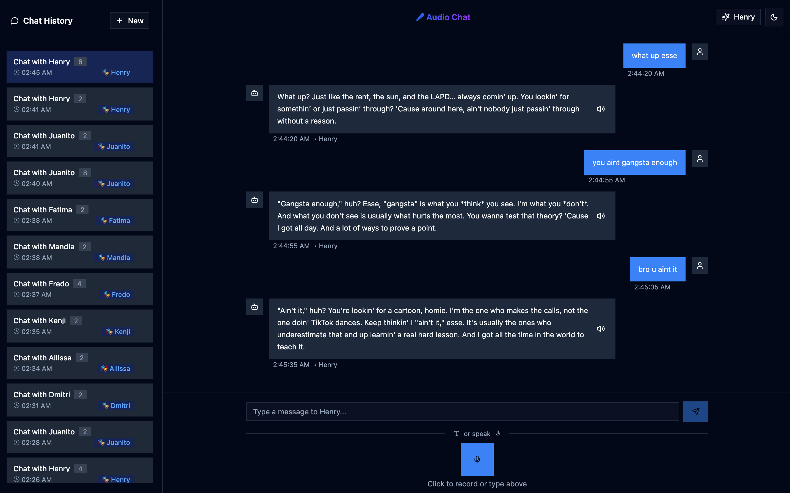

# Audio Chat with Gemini AI & Supabase

> This entire app was vibe-coded and edited in a single evening.

A modern voice-powered chat application featuring AI-powered conversations with multiple personas, and native text-to-speech synthesis using [Gemini TTS Preview](https://ai.google.dev/gemini-api/docs/speech-generation). Built with Google's Gemini AI, React, and Supabase for persistent conversation history.



## ✨ Features

- 🎤 **Voice Recording**: High-quality audio recording using WebRTC MediaRecorder
- 🗣️ **Speech-to-Text**: Powered by Google Gemini 2.0 Flash for accurate transcription
- 🤖 **AI Conversations**: Natural dialogues with 23 unique AI personas, each with distinct personalities
- 🔊 **Text-to-Speech**: Realistic voice synthesis using Gemini's 2.5 TTS Preview with persona-specific voices
- 💾 **Persistent History**: Conversations automatically saved with Supabase PostgreSQL
- 👤 **Anonymous Sessions**: No sign-up required - automatic user tracking with cookies
- 📱 **Responsive Design**: Modern UI with Tailwind CSS and shadcn/ui components
- 🎭 **Multiple Personas**: Choose from diverse AI characters with unique voices and personalities
- 💬 **Text Chat**: Alternative text-based input for accessibility
- 🔄 **Real-time Audio**: Low-latency audio processing with AudioWorklet API

## 🏗️ Architecture

### Frontend (React 19 + Redux Toolkit)
- **React 19** with modern hooks and functional components
- **Redux Toolkit** for predictable state management
- **shadcn/ui** components for consistent, accessible UI
- **AudioWorklet** for high-performance, low-latency audio processing
- **js-cookie** for persistent user session management
- **Tailwind CSS** for responsive, utility-first styling
- **Lucide React** for modern iconography

### Backend (Express.js + Node.js)
- **Express.js** server with RESTful API endpoints
- **Google Gemini AI** integration for speech processing and generation
- **Supabase** client for database operations
- **CORS** enabled for cross-origin requests
- **Helmet** for security headers
- **Custom audio file serving** with caching

### Database (Supabase PostgreSQL)
- **Users table**: Anonymous user identifier tracking
- **Chats table**: Complete conversation history stored as JSONB
- **Personas table**: AI character definitions with voice mappings
- **Row Level Security (RLS)**: Secure, user-scoped data access
- **UUID primary keys**: Modern, scalable identifier system

## 🚀 Quick Start

### Prerequisites

- **Node.js 18+** and npm
- **Google AI API key** ([Get one here](https://ai.google.dev/))
- **Supabase project** ([Create one here](https://supabase.com/))

### 1. Installation

```bash
# Clone the repository
git clone <repository-url>
cd audio-chat

# Install backend dependencies
npm install

# Install frontend dependencies
cd frontend
npm install
cd ..
```

### 2. Set Up Supabase

#### Option A: Local Development (Recommended)

```bash
# Install Supabase CLI globally
npm install -g @supabase/cli

# Start local Supabase stack (PostgreSQL, API, Studio, etc.)
supabase start

# Apply database migrations to create tables and policies
supabase db reset
```

This will start:
- **Database**: PostgreSQL on port 54322
- **API**: Supabase API on port 54321  
- **Studio**: Database admin UI on port 54323
- **Inbucket**: Email testing on port 54324

#### Option B: Hosted Supabase

1. Create a new project at [supabase.com](https://supabase.com/)
2. Navigate to Settings > API to get your credentials
3. Apply migrations by copying each file from `supabase/migrations/` to the SQL Editor:
   - `20250109123000_create_users_and_chats_tables.sql`
   - `20250109141000_change_chat_id_to_uuid.sql` 
   - `20250109150000_create_personas_table.sql`
   - `20250109160000_add_persona_id_to_chats.sql`

### 3. Configure Environment Variables

Create a `.env.development` file in the project root:

```env
# Google AI API Key (Required)
GOOGLE_AI_API_KEY=your_google_ai_api_key_here

# Supabase Configuration
# For local development:
SUPABASE_URL=http://127.0.0.1:54321
SUPABASE_ANON_KEY=your_local_anon_key_from_supabase_start
SUPABASE_SERVICE_ROLE_KEY=your_local_service_role_key_from_supabase_start

# For hosted Supabase:
# SUPABASE_URL=https://your-project-ref.supabase.co
# SUPABASE_ANON_KEY=your_hosted_anon_key
# SUPABASE_SERVICE_ROLE_KEY=your_hosted_service_role_key

# Server Configuration
PORT=3001
```

### 4. Initialize Personas

Sync the AI personas to your database:

```bash
# This populates the personas table with character definitions
npm run sync:personas
```

### 5. Run the Application

```bash
# Terminal 1: Start the backend server
npm run dev

# Terminal 2: Start the frontend development server
cd frontend
npm run dev
```

🎉 **Visit `http://localhost:5173` to start chatting!**

## 📊 Database Schema

### Users Table
```sql
users (
  id: uuid (primary key, auto-generated)
  uid: text (unique, not null - anonymous user identifier)
  created_at: timestamptz (auto-generated)
  updated_at: timestamptz (auto-updated)
)
```

### Chats Table  
```sql
chats (
  id: uuid (primary key, auto-generated)
  uid: text (foreign key to users.uid)
  persona_id: uuid (foreign key to personas.id)
  title: text (auto-generated from first message)
  messages: jsonb (array of message objects)
  created_at: timestamptz (auto-generated)
  updated_at: timestamptz (auto-updated)
)
```

### Personas Table
```sql
personas (
  id: uuid (primary key, auto-generated) 
  name: text (unique, not null - persona name)
  tone: text (personality description and behavior)
  voice_name: text (Gemini TTS voice identifier)
  created_at: timestamptz (auto-generated)
  updated_at: timestamptz (auto-updated)
)
```

### Message Format
```json
{
  "type": "user|bot",
  "content": "message text content",
  "timestamp": "2024-01-09T12:30:45.123Z",
  "audioUrl": "/api/audio/uid/chatId/filename.pcm", // bot messages only
  "isProcessing": false
}
```

## 🔌 API Endpoints

### Chat Management
- `GET /api/chats/:uid` - Get user's chat history with persona info
- `GET /api/chats/:uid/:chatId` - Get specific chat with full message history
- `DELETE /api/chats/:uid/:chatId` - Delete a specific chat
- `POST /api/chat` - Send audio message and receive AI response with TTS
- `POST /api/chat/text` - Send text message and receive AI response with TTS

### Personas & Assets
- `GET /api/personas` - Get all available AI personas
- `GET /api/audio/:uid/:chatId/:filename` - Serve cached TTS audio files

### Request/Response Examples

#### Send Audio Message
```javascript
POST /api/chat
Content-Type: application/json

{
  "base64Audio": "data:audio/webm;base64,UklGRnoGAABXQVZFZm10...",
  "personaName": "Bob",
  "personaId": "uuid-here",
  "uid": "user-uuid",
  "chatId": "chat-uuid" // optional for new chats
}
```

## 👤 User Session Management

The application uses anonymous user identification without requiring sign-up:

**Storage Strategy:**
1. **HTTP Cookie** (`audio_chat_uid`) - Primary storage, expires in 1 year
2. **LocalStorage** (`audio_chat_uid_backup`) - Fallback storage

**Benefits:**
- ✅ No registration required
- ✅ Persistent across browser sessions
- ✅ Cross-tab synchronization
- ✅ Graceful fallback if cookies disabled
- ✅ Privacy-focused anonymous usage

## 🎭 AI Personas System

The application features 23 unique AI personas, each with:

- **Distinct Personality**: From "Bob" (grizzled Manchester roadie) to "Fredo" (ethereal AI entity)
- **Custom Voice**: Mapped to specific Gemini TTS voices for immersive experience
- **Behavioral Consistency**: Maintains character throughout conversations
- **Cultural Diversity**: Characters from different backgrounds and locations

**Example Personas:**
- **Bob**: Grizzled, chain-smoking roadie with Manchester accent
- **Solange**: Cynical Parisian poet with smoky, nihilistic whisper
- **Kenji**: Jaded Tokyo hacker with rapid-fire tech jargon
- **Isabella**: Fierce capoeira fighter from Rio's favelas

## 🔄 Conversation Context

**Context Management:**
1. **Message History**: Full conversation context for coherent responses
2. **Persona Consistency**: AI maintains character voice and behavior
3. **Chat Segmentation**: Conversations organized by chat ID for topic continuity
4. **Memory Persistence**: Context preserved across browser sessions

## 🛠️ Development

### Project Structure
```
audio-chat/
├── server.js                 # Express.js backend server
├── package.json              # Backend dependencies & scripts
├── .env.development          # Environment variables
├── supabase/
│   ├── config.toml           # Local Supabase configuration
│   └── migrations/           # Database schema migrations
├── frontend/
│   ├── src/
│   │   ├── components/       # React UI components
│   │   │   ├── ui/          # shadcn/ui base components
│   │   │   ├── ChatHistory.jsx
│   │   │   └── PersonaSelector.jsx
│   │   ├── store/           # Redux store & slices
│   │   │   ├── store.js     # Store configuration
│   │   │   └── slices/      # Feature-based state slices
│   │   ├── hooks/           # Custom React hooks
│   │   │   └── useAudioPlayer.js
│   │   └── utils/           # Utility functions
│   │       └── userUtils.js # User session management
│   ├── package.json         # Frontend dependencies
│   └── vite.config.js       # Vite build configuration
├── configs/
│   └── personas.json        # AI persona definitions
├── scripts/
│   └── sync-personas.js     # Database persona sync utility
└── utils/
    ├── db.js               # Supabase database utilities
    ├── generate.js         # Google AI integration
    └── helpers.js          # General utility functions
```

### Key Technologies & Libraries

**Backend:**
- `@google/genai` - Gemini AI integration
- `@supabase/supabase-js` - Database client
- `express` - Web framework
- `cors` - Cross-origin resource sharing
- `helmet` - Security headers

**Frontend:**
- `react` ^19.1.0 - UI framework
- `@reduxjs/toolkit` - State management
- `@radix-ui/*` - Accessible UI primitives  
- `tailwindcss` - Utility-first CSS
- `lucide-react` - Icon library
- `js-cookie` - Cookie management

### NPM Scripts

**Backend:**
```bash
npm run dev          # Start development server
npm run sync:personas # Sync persona data to database
npm run push:db      # Push schema changes to Supabase
```

**Frontend:**
```bash
npm run dev          # Start Vite development server
npm run build        # Build for production
npm run preview      # Preview production build
npm run lint         # Run ESLint
```

### Development Workflow

1. **Start Local Stack**: `supabase start`
2. **Sync Personas**: `npm run sync:personas`
3. **Backend**: `npm run dev` (port 3001)
4. **Frontend**: `cd frontend && npm run dev` (port 5173)
5. **Database Admin**: Visit http://localhost:54323

## 🐛 Troubleshooting

### Audio Issues
- ✅ **Microphone Permissions**: Ensure browser has microphone access
- ✅ **Browser Compatibility**: Chrome/Firefox recommended for WebRTC
- ✅ **HTTPS Requirement**: Microphone access requires HTTPS in production
- ✅ **AudioWorklet Support**: Modern browsers required for low-latency audio

### Database Connection
- ✅ **Local Supabase**: Verify `supabase start` completed successfully
- ✅ **Environment Variables**: Check `.env.development` file exists with correct values  
- ✅ **Migrations**: Ensure all migration files have been applied
- ✅ **RLS Policies**: Verify Row Level Security policies allow data access

### API & Integration
- ✅ **Google AI Quota**: Confirm API key is valid with sufficient quota
- ✅ **CORS Settings**: Verify cross-origin requests are allowed
- ✅ **Network Issues**: Check firewall/proxy settings for WebRTC
- ✅ **Rate Limiting**: Google AI has usage limits

### Common Error Solutions

**"Failed to load personas"**: Run `npm run sync:personas`
**"Microphone not accessible"**: Check browser permissions in URL bar
**"Supabase connection failed"**: Verify local Supabase is running with `supabase status`
**"Google AI API error"**: Check API key and quota in Google AI Studio

## 🚀 Production Deployment

### Environment Setup
1. **Hosted Supabase**: Create production project
2. **Environment Variables**: Set production values
3. **HTTPS**: Required for microphone access
4. **CDN**: Consider audio file caching
5. **Monitoring**: Set up error tracking

### Performance Optimization
- **Audio Caching**: TTS files cached locally per user/chat
- **Database Indexing**: Optimized queries with proper indexes
- **Memory Management**: Efficient Redux state management
- **Bundle Splitting**: Vite code splitting for faster loads

## 🤝 Contributing

1. **Fork** the repository
2. **Create** feature branch: `git checkout -b feature/amazing-feature`
3. **Commit** changes: `git commit -m 'Add amazing feature'`
4. **Push** to branch: `git push origin feature/amazing-feature`
5. **Open** a Pull Request

### Code Standards
- **ESLint**: Consistent code formatting
- **React Hooks**: Follow hooks rules and patterns
- **TypeScript**: Types for better code safety (future enhancement)
- **Testing**: Add tests for new features

## 📄 License

MIT License - see LICENSE file for details

## 🙏 Acknowledgments

- **[Google Gemini AI](https://ai.google.dev/)** - Powerful multimodal AI capabilities
- **[Supabase](https://supabase.com/)** - Seamless database and authentication  
- **[shadcn/ui](https://ui.shadcn.com/)** - Beautiful, accessible React components
- **[Tailwind CSS](https://tailwindcss.com/)** - Utility-first CSS framework
- **[Radix UI](https://www.radix-ui.com/)** - Low-level UI primitives 